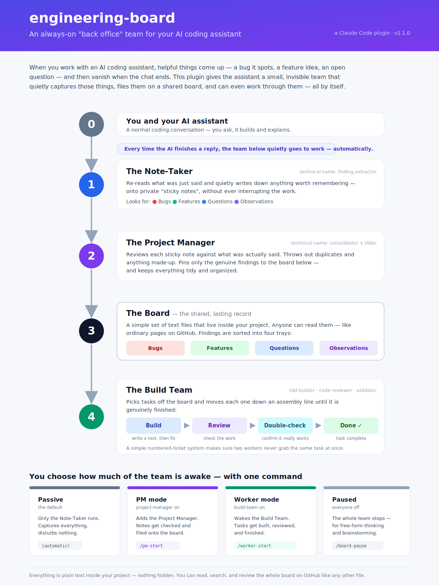

<div align="center">

<picture>
  <source media="(prefers-color-scheme: dark)" srcset="brand/logomark-dark.svg">
  <source media="(prefers-color-scheme: light)" srcset="brand/logomark-light.svg">
  
</picture>

# engineering-board

**A git-committed kanban board your AI agents run and remember.**

_The board is the database._

[](LICENSE)
[](CHANGELOG.md)
[](https://github.com/GhostlyGawd/engineering-board/actions/workflows/test.yml)
[](https://code.claude.com/docs/en/plugin-marketplaces)
[](mcp-server/README.md)



_A finding is captured, promoted, and driven through `tdd → review → validate` to done — [rendered live by `/board-view`](engineering-board/eb-self/board.html), every step committed markdown you can diff._

</div>

## What it is

engineering-board turns a committed markdown tree — `engineering-board/<project>/` — into an autonomous, multi-agent software-engineering board. Findings are captured passively from every session, promoted to the live board via deterministic consolidation, and worked through a `tdd → review → validate` state machine with atomic claim-locking. Coordination state, work-in-progress locks, and durable learnings all live as markdown in your repo — no hidden database, no external service, no daemon. It ships as a native Claude Code plugin **and**, as of 1.2.0, a zero-dependency MCP server.

### Why it's different

The market splits into two camps: **visible-but-dumb** git-markdown boards (no locking, no memory) and **smart-but-opaque** MCP coordination servers (locks and memory, but hidden in a database). engineering-board is the four-way intersection neither camp reaches:

- **git-committed, human-visible board** — reviewed in the same PRs as your code
- **durable cross-session memory** — recurring lessons promote into committed `Learning` entries
- **atomic multi-agent claim-locking** — parallel worker agents never collide
- **native to Claude Code** — plus an MCP server for any MCP client

## Value props

**VP1 — Visible, diffable coordination state.** Your agents' board is committed markdown, reviewed in the same PRs as code. Every entry is validated on write (frontmatter + index) by `board-validate-entry.sh`; the index and structural graph are regenerated deterministically by `/board-rebuild` and `/board-graph`.

**VP2 — Durable cross-session memory.** Recurring lessons promote into committed `Learning` entries (`L###`) that survive session boundaries. The `learnings-curator` scans resolved entries and promotes `pattern:` tags with recurrence ≥ 3 via `board-curate-learnings.sh`. Idempotent.

**VP3 — Collision-free parallel agents.** Atomic `mkdir`-based claim-locking with heartbeat, stale reclamation, and cloud-sync detection lets multiple worker agents run without stepping on each other (`board-claim-acquire/release/reclaim-stale.sh`, tested under `tests/claims/`).

**VP4 — Autonomous build pipeline.** Findings flow through a `tdd → review → validate` state machine driven by the Stop hook. Worker mode dispatches `tdd-builder` / `code-reviewer` / `validator` on each entry's `needs:` state and writes back the suggested next step.

**VP5 — Runs where you already are, and everywhere else.** A native Claude Code plugin (commands, agents, hooks, skills) **and** an MCP server exposing the same board format to any MCP client — Claude Desktop, Claude Code, or your own.

## Quickstart

Two paths. The plugin gives you the full autonomous pipeline inside Claude Code; the MCP server exposes the board to any MCP client.

### Plugin (Claude Code)

Install from this repo's own marketplace:

```
/plugin marketplace add GhostlyGawd/engineering-board
/plugin install engineering-board
```

Then scaffold a board, once per project:

```
/board-init <project> [affects-prefix]
```

Grant the pipeline's permissions once, so it runs without prompting on every step:

```
/board-install-permissions
```

**Now you have a board. Here's how the first value shows up — no further setup:**

1. **Capture is automatic.** Just work in Claude Code as usual. When a turn ends, the Stop hook quietly extracts any bug/feature/question/observation you or the agent surfaced and writes it to the board's scratch inbox at `engineering-board/<project>/_sessions/`. You don't run anything — capture is a passive side effect. (Peek at that folder to confirm it's working.)
2. **Promote when you're ready.** Run `/pm-start`, then end a turn: the PM pipeline consolidates the scratch findings into real, committed board entries under `engineering-board/<project>/bugs/` (etc.) and updates `BOARD.md`. That's your first entry on the board.
3. **Let an agent work it.** Run `/worker-start --discipline tdd`, then end a turn: a worker claims a `needs: tdd` entry and drives it through the `tdd → review → validate` pipeline. (Advancing one entry across all three disciplines currently takes one worker session per discipline — see the [roadmap](#roadmap).)

**What to expect (measured, following only this page):** first captured finding in ~5 minutes from install; first promoted board entry in ~10–15 minutes once you run `/pm-start`. The capture in step 1 is deliberately quiet — if you want a visible confirmation, look in `_sessions/`, or run `/board-view` to open a themed visual Kanban of the board (or `/board-rebuild` to refresh the markdown `BOARD.md` index). Full mode reference is the [feature tour](#feature-tour) below.

### MCP server

Register the zero-dependency `python3` server with the Claude Code CLI:

```sh
claude mcp add engineering-board -- python3 /abs/path/to/engineering-board/mcp-server/engineering_board_mcp.py
```

Or add it to Claude Desktop's `claude_desktop_config.json`:

```json
{
  "mcpServers": {
    "engineering-board": {
      "command": "python3",
      "args": ["/abs/path/to/engineering-board/mcp-server/engineering_board_mcp.py"]
    }
  }
}
```

Installing the plugin auto-registers the same server via the repo-root [`.mcp.json`](.mcp.json) (resolved through `${CLAUDE_PLUGIN_ROOT}`), so no separate step is needed when the plugin is installed. Full config reference: [`mcp-server/README.md`](mcp-server/README.md).

## Feature tour

<div align="center">



</div>

**Modes** — the Stop hook reads `.engineering-board/session-mode.json` and routes to one procedure (canonical: [`hooks/stop-hook-procedure.md`](hooks/stop-hook-procedure.md)):

| Mode | Set by | Stop dispatches |
|---|---|---|
| **Passive** (default) | nothing | `finding-extractor` only — captures findings without disturbing work |
| **Paused** | `/board-pause` | nothing (emits `<<EB-PASSIVE-PAUSED>>`) — bypass capture while drafting |
| **PM** | `/pm-start` | `finding-extractor` → `consolidator` → `tidier` → `learnings-curator` |
| **Worker** | `/worker-start --discipline <tdd\|review\|validate>` | claim-acquire → `tdd-builder` / `code-reviewer` / `validator` → claim-release |

**Commands (11)** — `/board-init`, `/board-rebuild`, `/board-graph`, `/board-view`, `/board-pause`, `/board-resume`, `/pm-start`, `/worker-start`, `/board-install-permissions`, `/board-claim-release`, `/board-migrate`.

**Agents (8)** — `board-manager` (router over the 4 skills); the PM pipeline `finding-extractor` → `consolidator` → `tidier` → `learnings-curator`; the Worker pipeline `tdd-builder` / `code-reviewer` / `validator` (the validator is strictly read-only).

**Skills (4)** — `board-intake`, `board-triage`, `board-resolve`, `board-consolidate`, sharing the `references/auto-resolve-pass.md` protocol.

**Hooks (4 events)** — `SessionStart` (board view), `PostToolUse(Write)` (entry validation), `UserPromptSubmit` (routing reminder), `Stop` (mode-routed orchestrator).

## The MCP tools

Eleven tools, all backed by the same on-disk format the plugin's hooks and skills expect. Locking is not reimplemented — `board_claim` / `board_release` shell out to the plugin's existing claim scripts.

| Tool | What it does |
|---|---|
| `board_init` | Scaffold a project board (router row, `BOARD.md`, `ARCHIVE.md`, subdirs). Idempotent. |
| `board_list_projects` | List projects from `BOARD-ROUTER.md` (id, path, affects prefix). |
| `board_create_entry` | Create a valid entry with correct frontmatter + body sections; allocate the next id; rebuild the index. |
| `board_list_entries` | List entries with parsed frontmatter; filters `project` / `type` / `status` / `needs`. |
| `board_get_entry` | Full markdown of one entry by id, plus parsed frontmatter. |
| `board_update_entry` | Update frontmatter and/or append a body section; validate the status transition; rebuild the index. |
| `board_rebuild` | Deterministically regenerate `BOARD.md` from entry files. Idempotent. |
| `board_capture_finding` | Append a finding to the scratch inbox `_sessions/mcp-<UTC-date>.md`. |
| `board_claim` | Acquire an entry lock (shells out to `board-claim-acquire.sh`). |
| `board_release` | Release an entry lock (shells out to `board-claim-release.sh`). |
| `board_status` | Overview: per-type open counts, `in_progress` / `blocked` ids, un-promoted scratch count. |

## Comparison

Honest and cited; traction figures are live snapshots (2026-07-04) that drift.

| | git-committed board? | durable memory? | atomic multi-agent locking? | Claude-native? | MCP? |
|---|:---:|:---:|:---:|:---:|:---:|
| **engineering-board** | Yes | Yes | Yes | Yes | Yes |
| [Backlog.md](https://github.com/MrLesk/Backlog.md) · ~5.9k★ | Yes | No | No | No | Yes |
| [Agent-MCP](https://github.com/rinadelph/Agent-MCP) · ~1.3k★ | No (RAG DB) | Yes (opaque) | Yes | No | Yes |
| [kanban-mcp](https://github.com/eyalzh/kanban-mcp) · ~40★ | No (SQLite) | No | No | No | Yes |
| [claude-code-workflows](https://github.com/shinpr/claude-code-workflows) · ~536★ | No (ephemeral) | No | No | Yes | No |
| [Flux](https://paddo.dev/blog/flux-kanban-for-ai-agents/) · early | No (side-branch SQLite/JSON) | No | No | No | Yes |

No competitor combines all four traits engineering-board owns — git-committed board + durable memory + atomic locking + Claude-native — now with MCP as the fifth.

**Where they're better (fairness note):** [Backlog.md](https://github.com/MrLesk/Backlog.md) is the category leader by a wide margin, with a polished Kanban UI and broad install channels (npm/Homebrew/Nix/Bun); [Agent-MCP](https://github.com/rinadelph/Agent-MCP) ships a richer RAG knowledge-graph and a live dashboard. engineering-board is younger and not yet on a public marketplace — install it from this repo's marketplace.

## Architecture

The board is human-visible markdown (cards, a `BOARD.md` index, a `GRAPH.yml` structural graph, a `BOARD-ROUTER.md`), not a hidden database. Everything runs on vanilla Claude Code primitives — hooks, slash commands, subagents, `Task()` dispatch — plus `bash` + `python3`. Zero runtime package dependencies. Full contributor-facing map: [`ARCHITECTURE.md`](ARCHITECTURE.md).

## Roadmap

Directional and honest — the items below are designed, not shipped.

- **Conductor** ([`docs/rfcs/0001-symphony-conductor.md`](docs/rfcs/0001-symphony-conductor.md), Draft) — an always-on deterministic orchestrator that drives the board to PRs across sessions with no human in the loop, spawning observable interactive worker sessions per bounded round. Additive and opt-in; not built.
- **Consolidation research** ([`docs/research/agentic-ecosystem/`](docs/research/agentic-ecosystem/)) — comparing the agentic systems in this ecosystem toward one product. Feeds a future PRD.
- **Broader distribution** — submission to the Claude community marketplace, the official MCP Registry, and awesome-lists is prepared; see [`.goal/POSITIONING.md`](.goal/POSITIONING.md) §2.

## Contributing

The test suite is bash + python3 only, no install step:

```sh
bash tests/run-all.sh   # 14 suites
```

Cross-compat rules for any new `hooks/scripts/*.sh` (pinned by `tests/crosscompat-lint.sh`): shebang exactly `#!/usr/bin/env bash`; no `date -d` / `date -j -f`; no `jq`; no drive letters — use `python3` for JSON and timestamps. Version bumps must touch both `.claude-plugin/plugin.json` and `marketplace.json` in lockstep. Develop on a branch and land changes via PR — never push to `main` directly.

## License

[MIT](LICENSE).
