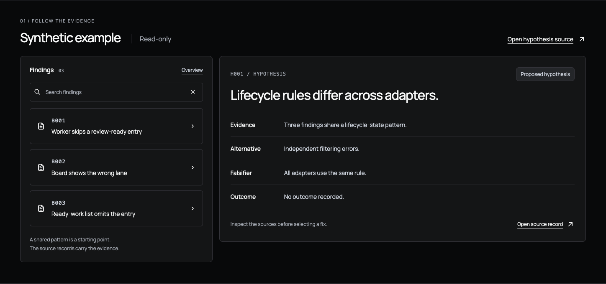
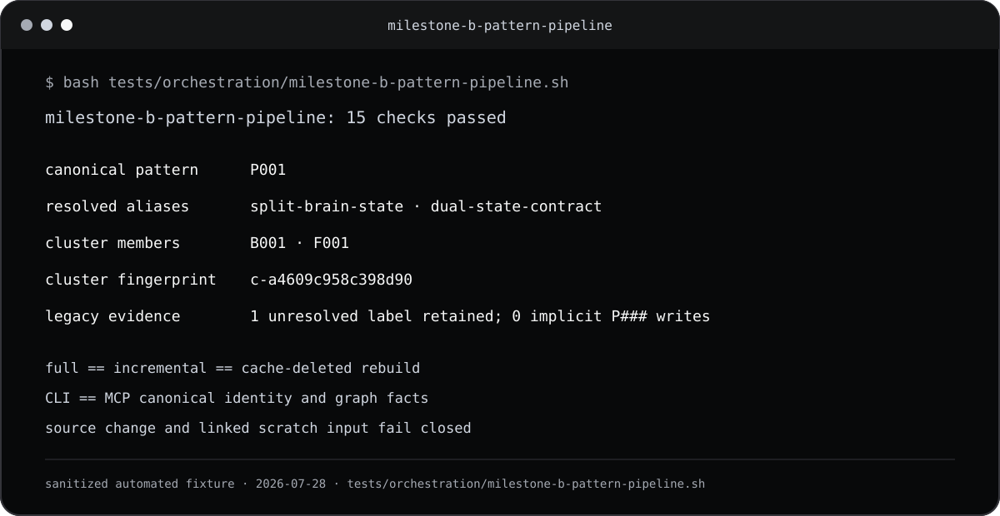
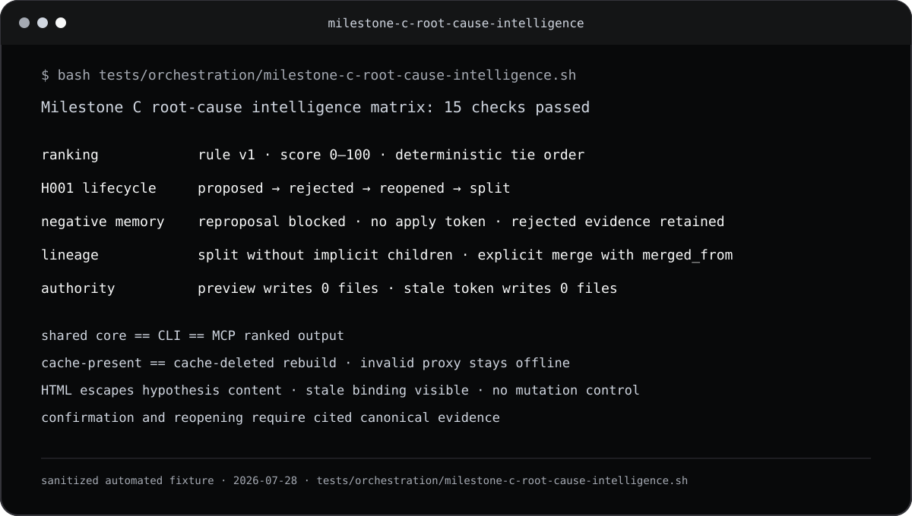
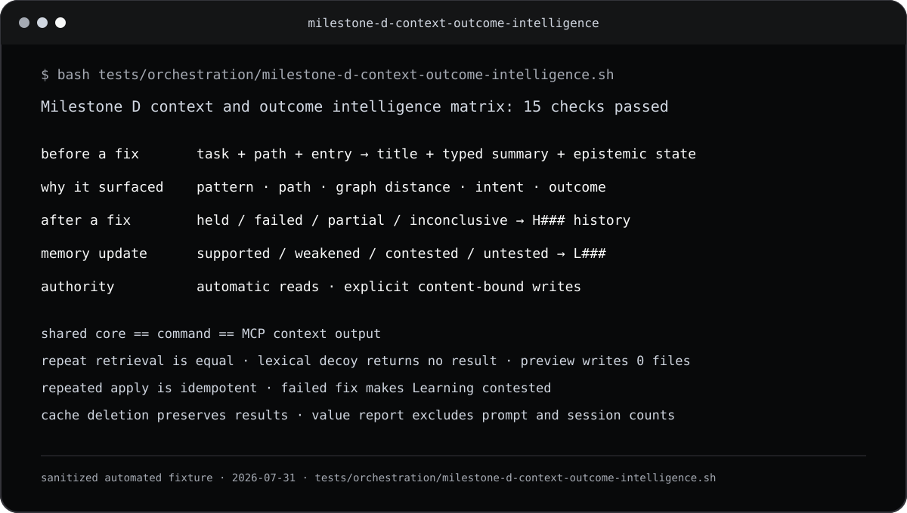
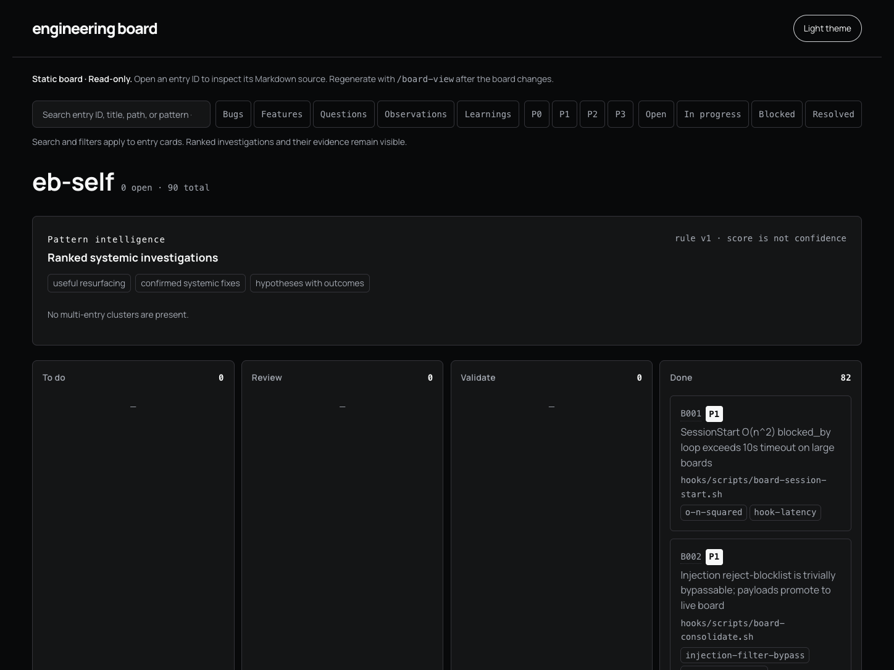

<div align="center">

<picture>
  <source media="(prefers-color-scheme: dark)" srcset="brand/logomark-dark.svg">
  <source media="(prefers-color-scheme: light)" srcset="brand/logomark-light.svg">
  
</picture>

# Engineering Board

**Repository pattern memory that helps an engineering agent find a root cause.**

_The board is the database._

[](https://ghostlygawd.github.io/engineering-board/)
[](LICENSE)
[](CHANGELOG.md)
[](https://github.com/GhostlyGawd/engineering-board/actions/workflows/test.yml)
[](https://developers.openai.com/codex/plugins)
[](https://code.claude.com/docs/en/plugin-marketplaces)
[](mcp-server/README.md)
[](https://github.com/GhostlyGawd/engineering-board/stargazers)
[](https://github.com/GhostlyGawd/engineering-board/releases)



_Run `/board-demo` to make this synthetic example._



_This visual shows real deterministic fixture output for the pattern pipeline._



_This visual shows real deterministic fixture output for root-cause memory._



_This visual shows the tested context-to-outcome memory loop._



_This repository uses its own Engineering Board._

</div>

## Product description

Engineering Board is a repository-owned pattern-intelligence system for
engineering agents.

The system records bugs, features, questions, and observations as Markdown
evidence. It connects recurring findings in a deterministic graph.

The graph helps an agent investigate a shared cause across different domains.
This method reduces repeated corrections of individual symptoms.

Markdown is the canonical record. A pull request can show each change to this
record.

`BOARD.md`, `GRAPH.yml`, JSON analysis, and HTML are derived views. The system
can build these views again from the canonical record.

A hypothesis is separate from a deterministic graph fact. Only investigation
evidence or fix evidence can confirm a hypothesis.

The optional `tdd → review → validate` loop can test a fix. This loop supports
the pattern memory, but it does not define the product.

Milestone C adds:

- A transparent investigation score from 0 through 100
- A durable H### hypothesis lifecycle
- Negative memory for a rejected claim.

Each score component is visible. A score does not prove that a cause is true.

Milestone D puts this memory in the agent's decision path:

- `board_context` retrieves relevant clusters, hypotheses, negative memory, and
  Learnings before the agent selects a fix.
- Each result shows a stable title, a typed summary of at most 2,000
  characters, the epistemic state, structural signals, score components,
  match reason, and canonical sources.
- A task-only miss tells the caller to add a file, entry identifier, or current
  directory. Task words do not bypass structural eligibility.
- `board_outcomes` records an explicit fix result against an H### hypothesis.
- Structured outcomes update Learning state and confidence through a separate
  preview and apply operation.
- A derived value report counts verified reuse and systemic fix evidence. It
  does not count prompts, sessions, or other activity.

Milestone D.1 adds a repository-only evaluation harness and eight sanitized
cases. The default contract prepares 24 isolated baseline/context pairs for a
Codex reference run. Other clients can run as optional replications without
changing the product gate. Protocol and package tests establish supported
client surfaces without requiring provider accounts. The first Codex run
scored 100 percent in both positive baseline and context arms, so the corpus
was retained as a non-scored calibration set. A separate locked evidence
corpus excludes declared scoring oracles and requires rejected memory in its
lexical-decoy contexts. Its reference run scored 100 percent for context and
83.33 percent for baseline. The 16.67-point difference did not meet the
required 25-point improvement. The project does not claim that the context
improves agent diagnoses.

The unlocked version 4 proposal now limits each positive case to one visible
current incident. It also requires a positive classification to connect that
incident to prior repository evidence. A non-scored proposal preflight found
that v1.11.0 ranks the expected memory but does not include the memory title,
cause, or summary in the returned result. Context contract version 2 added
that bounded canonical content with its separate epistemic state, match
reason, and sources. Current contract version 3 preserves those limits and
adds confidence for moment-of-need Learning delivery. A current-source,
one-repetition preflight then produced zero qualifying cross-incident first
causes in both the four baseline arms and the four context arms. The expected
memories ranked first or second, but the responses did not connect their
current incident to the prior incident. This is not a scored product-effect
result. The proposal remains unlocked, and the exact baseline decision remains
with the product owner. See
[`evaluation/README.md`](evaluation/README.md) for the proof boundary and
operator commands.

## Product differences

Some Git boards show visible state but have little analysis. Some memory
systems have useful analysis but keep the source outside the repository.

Engineering Board combines these properties:

- Repository evidence that a pull request can review
- A cross-domain pattern graph with evidence links
- H### records with alternatives and falsifiers
- Negative memory for rejected claims
- Atomic claims for parallel agents
- Passive capture
- Codex and Claude Code plugins
- An MCP server.

Native Claude Code Tasks and Engineering Board have different purposes.

Native Tasks store personal task state in `~/.claude/tasks/`. This state is not
part of a project pull request.

Engineering Board stores shared project memory in the repository. Use Native
Tasks for temporary personal work. Use Engineering Board for durable project
knowledge.

## Install the Codex plugin

Add the repository marketplace:

```sh
codex plugin marketplace add GhostlyGawd/engineering-board
```

Install the plugin:

```sh
codex plugin add engineering-board@engineering-board
```

The Codex marketplace installs the repository root from the immutable Git tag
that matches the advertised plugin version. Refresh the marketplace before
installing a newer released version.

Start a new Codex session. The plugin supplies five board skills and starts the
19-tool Engineering Board MCP server. It does not require a model-provider
account. The Codex manifest explicitly selects `hooks/codex-hooks.json`, which
contains no automatic hooks. Codex therefore uses the skills and MCP server
without loading the Claude Code hook workflow from `hooks/hooks.json`.

Ask Codex to initialize Engineering Board in the active repository. The agent
passes the absolute repository root to `board_init` and uses the MCP tools for
capture, promotion, context, graph, hypothesis, outcome, claim, and lifecycle
operations.

## Install the Claude Code plugin

Add the repository marketplace:

```text
/plugin marketplace add GhostlyGawd/engineering-board
```

Install the plugin:

```text
/plugin install engineering-board
```

Set up a board:

```text
/board-setup
```

`/board-setup` creates the board structure. It also checks the required
permissions.

Run the contained demonstration:

```text
/board-demo
```

The command creates a synthetic run in
`.engineering-board/demo/pattern-intelligence/`.

The command connects three findings from different domains. It then requests
one hypothesis that cites the evidence.

The hypothesis has `status: proposed`. It includes an alternative explanation
and a falsifier.

The report gives an exact cleanup command. The cleanup operation preserves a
changed run.

For explicit setup values, use:

```text
/board-init <project> [affects-prefix]
/board-install-permissions
```

## Use the pattern-memory workflow

With Codex or another MCP client:

1. Initialize one project with `board_init`.
2. Retrieve relevant memory with `board_context` before selecting a fix.
3. Capture findings with `board_capture_finding`.
4. Preview and apply promotion with `board_promote_findings`.
5. Use `board_insights` and `board_hypotheses` for evidence-linked shared-cause
   analysis.
6. Record the observed result with `board_outcomes`.

Pass the absolute repository root in each bundled-plugin tool call. The plugin
does not guess which open workspace a raw MCP call targets.

With Claude Code hooks and commands:

1. Work in Claude Code.
2. Let SessionStart and UserPromptSubmit retrieve relevant systemic memory.
3. Run `/board-context <project>` when you want the same bounded brief
   explicitly.
4. Read the memory title, typed summary, epistemic state, match reason, and
   sources. Inspect the cited canonical record before you rely on a proposed
   cause.
5. In PM mode, read the matched medium/high-confidence Learnings appended to
   the pass summary after new findings promote.
6. Let the Stop hook capture a finding in
   `engineering-board/<project>/_sessions/`.
7. Run `/board-promote` to preview canonical changes.
8. Apply the unchanged promotion plan after you review it.
9. Run `/board-insights <project>` when you need the complete ranked
   investigation view.
10. Run `/board-hypothesis <project> propose` to preview an H### record.
11. Review the evidence, alternative, counter-evidence, confidence basis, and
    falsifier.
12. Apply the unchanged hypothesis plan.
13. After verification, run `/board-outcome <project> preview ...`.
14. Apply the unchanged outcome plan. Review and apply each returned Learning
    plan separately.

An outcome records `held`, `failed`, `partial`, or `inconclusive`. It can
confirm, weaken, reject, or leave a hypothesis unchanged only through a
compatible explicit disposition.

Use `/pm-start` only for advanced batch promotion. Use the optional Worker loop
only when you want to test a selected fix.

## Use one session mode

`/pm-start` and `/worker-start` set
`.engineering-board/session-mode.json`.

A session can have one mode. Start a new session to change the mode.

On Claude Code web, each session uses a new clone. On a local installation, the
mode file stays on disk.

To return to passive capture:

1. Start a new session.
2. Read the `SessionStart` message.
3. If a mode remains, delete `.engineering-board/session-mode.json`.

## Register the MCP server without a plugin

Register the PyPI package with the Claude Code command-line interface (CLI):

```sh
claude mcp add engineering-board -- uvx engineering-board-mcp
```

To run the server from a clone:

```sh
git clone https://github.com/GhostlyGawd/engineering-board
claude mcp add engineering-board -- python3 "$(pwd)/engineering-board/mcp-server/engineering_board_mcp.py"
```

For Claude Desktop, add this object to `claude_desktop_config.json`:

```json
{
  "mcpServers": {
    "engineering-board": {
      "command": "uvx",
      "args": ["engineering-board-mcp"]
    }
  }
}
```

[`mcp-server/README.md`](mcp-server/README.md) also contains setup procedures
for Codex CLI, Gemini CLI, and Cursor.

The Claude Code plugin registers the server through [`.mcp.json`](.mcp.json).
The Codex manifest selects [codex-mcp.json](codex-mcp.json). Both files start
only Engineering Board through the same cross-platform launcher. The
Codex-specific file uses the `writes` approval policy: read-only memory tools
can run without a per-call prompt, while every write-capable tool stays gated.

## Product surfaces

The plugin has four session modes:

| Mode | Start method | Stop action |
|---|---|---|
| Passive | Default | Run `finding-extractor` |
| Paused | `/board-pause` | Do not capture a finding |
| PM | `/pm-start` | Run the four PM agents |
| Worker | `/worker-start --discipline <tdd\|review\|validate>` | Claim and process one entry |

The canonical Stop procedure is
[`hooks/stop-hook-procedure.md`](hooks/stop-hook-procedure.md).

**Commands (21):** `/board-setup`, `/board-demo`, `/board-context`,
`/board-outcome`, `/board-promote`, `/board-pattern`, `/board-insights`,
`/board-hypothesis`, `/board-run`, `/board-init`, `/board-rebuild`,
`/board-graph`, `/board-view`, `/board-remember`, `/board-pause`,
`/board-resume`, `/pm-start`, `/worker-start`,
`/board-install-permissions`, `/board-claim-release`, and `/board-migrate`.

**Agents (8):** `board-manager`, `finding-extractor`, `consolidator`, `tidier`,
`learnings-curator`, `tdd-builder`, `code-reviewer`, and `validator`.

**Skills (5):** `board-intake`, `board-triage`, `board-resolve`,
`board-consolidate`, and `board-insights`.

**Claude Code hooks (4 events):** `SessionStart`, `PostToolUse(Write)`,
`UserPromptSubmit`, and `Stop`. The Codex plugin selects its separate empty
hook manifest and uses the MCP-first workflow.

The MCP server has 19 tools. All tools use the same canonical Markdown and the
same deterministic core.

| Tool | Function |
|---|---|
| `board_init` | Create a project board |
| `board_list_projects` | List router projects |
| `board_create_entry` | Create a valid entry |
| `board_list_entries` | List and filter entries |
| `board_get_entry` | Get one entry |
| `board_update_entry` | Change one entry and archive a new resolution |
| `board_graph` | Build the deterministic graph |
| `board_context` | Retrieve bounded and explainable systemic memory |
| `board_insights` | Rank clusters and return linked evidence |
| `board_hypotheses` | List, preview, or apply H### operations |
| `board_outcomes` | Preview or apply fix outcomes and Learning feedback |
| `board_patterns` | List, preview, or apply P### operations |
| `board_promote_findings` | Preview or apply scratch promotion without reusing resolved IDs; an unchanged plan id restores an omitted preview session selector |
| `board_rebuild` | Build `BOARD.md` again |
| `board_capture_finding` | Add a finding to the scratch inbox |
| `board_claim` | Acquire an entry claim |
| `board_release` | Release an entry claim |
| `board_remember` | Save a learning |
| `board_status` | Show board state and ready work |

The six pure-read tools are `board_list_projects`, `board_list_entries`,
`board_get_entry`, `board_insights`, `board_context`, and `board_status`. Their
MCP schemas set `readOnlyHint: true`. Every other tool is classified by its
maximum capability. A tool that can preview and apply a change is therefore
write-capable for approval purposes. The Codex plugin's `writes` approval
policy lets the six pure-read tools run without a prompt and keeps every
write-capable tool approval-gated. These annotations are advisory metadata.
They do not replace host policy, root containment, content-bound plans, or
claim ownership.

## Architecture boundary

Canonical cards, hypotheses, Learnings, and `BOARD-ROUTER.md` use Markdown.
Derived views include `BOARD.md`, `GRAPH.yml`, context briefs, value reports,
JSON, and HTML.

The product does not require SQLite. A future SQLite index must be disposable
and rebuildable. Measured query requirements must justify it.

The shared MCP runtime uses Python 3 and has no third-party package dependency.
The Codex plugin uses Node.js only to select a Python interpreter on Windows or
Linux. Claude Code commands and hooks use Bash and Python 3.

Read [`ARCHITECTURE.md`](ARCHITECTURE.md) for the full system map.

## Roadmap boundary

Milestone D ships in v1.11.0.

The cross-session Conductor remains a draft RFC. `/board-run <entry-id>` ships
only the single-session inner loop.

Cross-repository intelligence, hosted services, and a required database remain
outside the current product boundary.

[`docs/PRODUCT_EVOLUTION_SPEC.md`](docs/PRODUCT_EVOLUTION_SPEC.md) is the
authoritative product-direction source.

## Contribute

Run the complete test suite:

```sh
bash tests/run-all.sh
```

The run-all command uses the maintained suite list. Read
[`CONTRIBUTING.md`](CONTRIBUTING.md) before you change the repository.

## Support

- Use [GitHub Discussions](https://github.com/GhostlyGawd/engineering-board/discussions) for questions.
- Use [GitHub Issues](https://github.com/GhostlyGawd/engineering-board/issues/new/choose) for bugs and features.
- Use [GitHub Security Advisories](https://github.com/GhostlyGawd/engineering-board/security/advisories/new) for a vulnerability.
- Use the [live board](https://ghostlygawd.github.io/engineering-board/board.html) for current project work.
- Use [GitHub Sponsors](https://github.com/sponsors/GhostlyGawd) to support the project.

GhostlyGawd maintains this open-source project.

## License

The project uses the [MIT License](LICENSE).

## Language status

The owner approved the current controlled-English text. The project does not
claim formal ASD-STE100 compliance, certification, or independent review.
