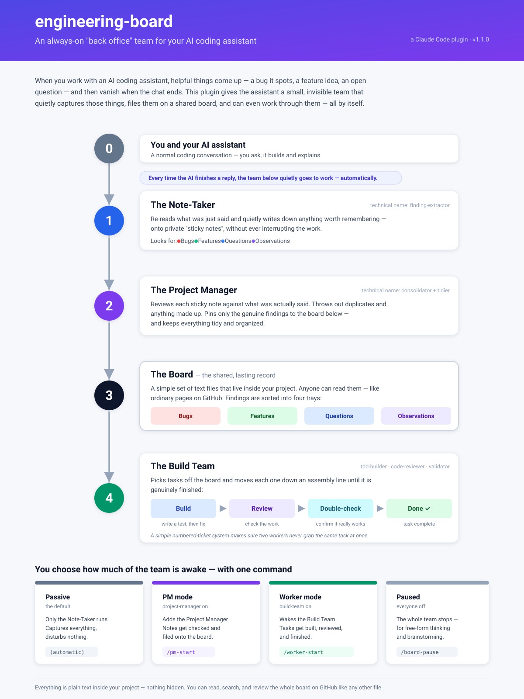

<div align="center">

<picture>
  <source media="(prefers-color-scheme: dark)" srcset="brand/logomark-dark.svg">
  <source media="(prefers-color-scheme: light)" srcset="brand/logomark-light.svg">
  
</picture>

# engineering-board

**Git-committed pattern memory that helps AI agents find the root cause.**

_The board is the database._

[](https://ghostlygawd.github.io/engineering-board/)
[](LICENSE)
[](CHANGELOG.md)
[](https://github.com/GhostlyGawd/engineering-board/actions/workflows/test.yml)
[](https://code.claude.com/docs/en/plugin-marketplaces)
[](mcp-server/README.md)
[](https://github.com/GhostlyGawd/engineering-board/stargazers)
[](https://github.com/GhostlyGawd/engineering-board/releases)


_Three surface-different symptoms become one evidence-linked systemic investigation candidate. Run `/board-demo` to reproduce the contained synthetic sample locally._


_Real deterministic fixture output for stable pattern identity, adapter parity,
preview/apply authority, and disposable-cache equivalence._


_the real thing — this repo's own board, as `/board-view` renders it_

</div>

## What it is

**engineering-board is a repository-owned pattern-intelligence system for engineering agents.** It records bugs, features, questions, and observations as visible Markdown evidence; connects recurring signals into a deterministic graph; and gives agents durable context for investigating shared root causes across domains instead of repeatedly patching symptoms in isolation.

Markdown remains the canonical, PR-reviewable record. `BOARD.md`, `GRAPH.yml`, and the HTML views are rebuildable projections over that evidence—not a competing source of truth. Proposed root-cause hypotheses stay visibly separate from deterministic graph facts and cannot become confirmed knowledge without investigation or fix evidence. Passive capture, atomic multi-agent claims, and the optional `tdd → review → validate` loop support that memory by collecting and testing evidence; they are not the product's headline.

### Why it's different

The market splits into two camps: **visible-but-shallow** git-markdown boards and **smart-but-opaque** memory-and-coordination engines whose useful state lives in a database or outside the repo. engineering-board joins the strengths of both and adds an explicit evidence → graph → hypothesis boundary:

- **git-committed evidence and memory** — reviewed in the same PRs as your code
- **cross-domain pattern graph** — recurring signals become explainable clusters with member evidence
- **bounded agent interpretation** — root-cause candidates cite evidence and remain `proposed`
- **atomic multi-agent claim-locking** — parallel worker agents never collide
- **native to Claude Code** — plus an MCP server for any MCP client

### Why not Claude Code's built-in Tasks?

Use both — they solve different problems. Native Tasks are genuinely good personal tracking: they persist across sessions, support dependencies, and come with a Ctrl+T board. But they live in `~/.claude/tasks/` — per-user and per-machine, outside the repo — so they're invisible in PRs and invisible to your teammates. They also have no capture pipeline, no review states, and no committed learnings. engineering-board is the **repo's** board: shared, PR-reviewable state that travels with the code and outlives any one user's machine. Keep native Tasks for in-session personal tracking; put the project's durable, team-visible state on the board — the two compose.

## Value props

**VP1 — Root-cause intelligence from accumulated findings.** Bugs that look unrelated in one-off chats can cluster through shared patterns and affected domains. Every cluster keeps the evidence trail and edge reason visible, so agents can investigate the systemic cause instead of guessing.

**VP2 — Visible, durable memory.** Canonical findings, hypotheses, and learnings are plain Markdown in the repo. Deterministic graph and visual projections are rebuildable. Recurring lessons promote into committed `Learning` entries (`L###`) that survive session boundaries.

**VP3 — Collision-free parallel agents.** Atomic `mkdir`-based claim-locking with heartbeat, stale reclamation, and cloud-sync detection lets multiple worker agents run without stepping on each other (`board-claim-acquire/release/reclaim-stale.sh`, tested under `tests/claims/`).

**VP4 — Falsifiable verification feedback.** When a fix is ready, the optional `tdd → review → validate` state machine can test the proposed explanation and feed the result back into durable memory.

**VP5 — Runs where you already are, and everywhere else.** A native Claude Code plugin (commands, agents, hooks, skills) **and** an MCP server exposing the same board format to any MCP client — Claude Desktop, Claude Code, or your own.

## Quickstart

Two paths. The plugin gives you the full autonomous pipeline inside Claude Code (requires [Claude Code](https://claude.com/claude-code), free); the MCP server exposes the board to any MCP client.

### Plugin (Claude Code)

Install from this repo's own marketplace:

```
/plugin marketplace add GhostlyGawd/engineering-board
/plugin install engineering-board
```

Then run the one-command setup (scaffolds the board with smart defaults and
checks the pipeline's permissions in a single step):

```
/board-setup
```

To see the product's pattern-intelligence loop before using real project data:

```
/board-demo
```

The command creates a contained synthetic run under
`.engineering-board/demo/pattern-intelligence/`, connects three findings from
different domains into a deterministic cluster, and asks the agent for one
evidence-cited hypothesis. The result stays `status: proposed` and includes an
alternative explanation and falsifier. The report prints the exact
manifest-verified cleanup command; modified runs are preserved rather than
deleted.

Prefer explicit control? `/board-init <project> [affects-prefix]` scaffolds with
your own names, and `/board-install-permissions` manages the permission
allowlist on its own — `/board-setup` simply composes the two.

**Now you have a board. Here's how real project memory accumulates:**

1. **Capture is automatic.** Just work in Claude Code as usual. When a turn ends, the Stop hook extracts any bug, feature, question, or observation and writes it to `engineering-board/<project>/_sessions/`. A non-empty capture prints a one-line summary and names `/board-promote` as the next action.
2. **Promote explicitly.** Run `/board-promote`. It previews created, duplicate, rejected, and unresolved-pattern outcomes without changing canonical state. Apply the returned content-bound plan to create committed entries, provenance receipts, `BOARD.md`, and `GRAPH.yml`. Use `/pm-start` only when you want advanced per-turn batch promotion.
3. **Inspect patterns before fixing symptoms.** Run `/board-graph` and `/board-view` to expose recurring signals, connected entries, and cross-domain structure. The production graph remains deterministic; interpreted root-cause hypotheses are kept separate from graph facts.
4. **Verify a chosen fix when useful.** Start a fresh Claude Code session, run `/worker-start --discipline tdd`, then end a turn. A worker claims a `needs: tdd` entry and drives it through the optional `tdd → review → validate` proof loop. To drive one entry through all three disciplines in one session, use `/board-run <entry-id>`.

> **One session, one mode.** `/pm-start` and `/worker-start` set a *session mode* (stored in `.engineering-board/session-mode.json`). A session holds one mode at a time, so switching from PM to Worker — or back to passive capture — is done by starting a new session, not by running the other command mid-session (it will decline and tell you to restart). On Claude Code web each session is a fresh clone, so a new session starts clean; on a local install the mode file persists on disk, so to return to plain passive capture, start a new session and, if it still shows a mode, delete `.engineering-board/session-mode.json`. The `SessionStart` banner prints the current mode so you always know where you are.

**What to expect (measured, following only this page):** first captured finding in ~5 minutes from install; first promotion preview in ~10 minutes once you run `/board-promote`. A successful non-empty capture prints a one-line confirmation; run `/board-view` to open a themed visual Kanban of the board (or `/board-rebuild` to refresh the Markdown index). Full mode reference is the [feature tour](#feature-tour) below.

### MCP server

Register the zero-dependency `python3` server with the Claude Code CLI — one line from PyPI:

```sh
claude mcp add engineering-board -- uvx engineering-board-mcp
```

Fallback — run it from a clone:

```sh
git clone https://github.com/GhostlyGawd/engineering-board
claude mcp add engineering-board -- python3 "$(pwd)/engineering-board/mcp-server/engineering_board_mcp.py"
```

Or add it to Claude Desktop's `claude_desktop_config.json`:

```json
{
  "mcpServers": {
    "engineering-board": {
      "command": "uvx",
      "args": ["engineering-board-mcp"]
    }
  }
}
```

Works with any MCP client — setup blocks for **Codex CLI**, **Gemini CLI**, and **Cursor** are in [`mcp-server/README.md`](mcp-server/README.md). Installing the plugin auto-registers the same server via the repo-root [`.mcp.json`](.mcp.json) (resolved through `${CLAUDE_PLUGIN_ROOT}`), so no separate step is needed when the plugin is installed.

## Feature tour

<div align="center">



</div>

**Modes** — the Stop hook reads `.engineering-board/session-mode.json` and routes to one procedure (canonical: [`hooks/stop-hook-procedure.md`](hooks/stop-hook-procedure.md)):

| Mode | Set by | Stop dispatches |
|---|---|---|
| **Passive** (default) | nothing | `finding-extractor` only — captures findings without disturbing work |
| **Paused** | `/board-pause` | nothing (emits `<<EB-PASSIVE-PAUSED>>`) — bypass capture while drafting |
| **PM** | `/pm-start` | `finding-extractor` → `consolidator` → `tidier` → `learnings-curator` |
| **Worker** | `/worker-start --discipline <tdd\|review\|validate>` | claim-acquire → `tdd-builder` / `code-reviewer` / `validator` → claim-release |

**Commands (17)** — `/board-setup`, `/board-demo`, `/board-promote`, `/board-pattern`, `/board-run`, `/board-init`, `/board-rebuild`, `/board-graph`, `/board-view`, `/board-remember`, `/board-pause`, `/board-resume`, `/pm-start`, `/worker-start`, `/board-install-permissions`, `/board-claim-release`, `/board-migrate`.

**Agents (8)** — `board-manager` (router over the 4 skills); the PM pipeline `finding-extractor` → `consolidator` → `tidier` → `learnings-curator`; the Worker pipeline `tdd-builder` / `code-reviewer` / `validator` (the validator is strictly read-only).

**Skills (5)** — `board-intake`, `board-triage`, `board-resolve`, `board-consolidate`, and `board-insights`. `board-insights` interprets deterministic cluster facts but can only write evidence-cited `proposed` hypotheses.

**Hooks (4 events)** — `SessionStart` (board view), `PostToolUse(Write)` (entry validation), `UserPromptSubmit` (routing reminder), `Stop` (mode-routed orchestrator).

## The MCP tools

15 tools, all backed by the same canonical Markdown and shared deterministic core. Locking is not reimplemented — `board_claim` / `board_release` shell out to the plugin's existing claim scripts.

| Tool | What it does |
|---|---|
| `board_init` | Scaffold a project board (router row, `BOARD.md`, `ARCHIVE.md`, subdirs). Idempotent. Optional `agents_md` (default true) writes a marker-fenced usage block into the repo's `AGENTS.md` for hook-less agents. |
| `board_list_projects` | List projects from `BOARD-ROUTER.md` (id, path, affects prefix). |
| `board_create_entry` | Create a valid entry with correct frontmatter + body sections; allocate the next id; rebuild the index. Optional `parent` links a subtask to an existing entry. |
| `board_list_entries` | List entries with parsed frontmatter; filters `project` / `type` / `status` / `needs` / `ready` (`ready: true` = the deterministic ready queue — open entries whose existing blockers are all resolved). |
| `board_get_entry` | Full markdown of one entry by id, plus parsed frontmatter. |
| `board_update_entry` | Update frontmatter (incl. `parent`) and/or append a body section; validate the status transition; rebuild the index. Optional `comment: {author, text}` appends a server-timestamped line under `## Comments`. |
| `board_graph` | Build the typed deterministic pattern graph, write `GRAPH.yml`, and reuse only a source-equivalent disposable cache. |
| `board_patterns` | List canonical P### records or preview/apply create, alias, assign, and correction operations. |
| `board_promote_findings` | Preview or apply scratch promotion with content-bound plans, per-finding outcomes, provenance, and idempotency. |
| `board_rebuild` | Deterministically regenerate `BOARD.md` from entry files. Idempotent. |
| `board_capture_finding` | Append a finding to the scratch inbox `_sessions/mcp-<UTC-date>.md`. |
| `board_claim` | Acquire an entry lock (shells out to `board-claim-acquire.sh`). |
| `board_release` | Release an entry lock (shells out to `board-claim-release.sh`). |
| `board_remember` | Save a durable insight straight to `learnings/L###` (`source: remember`), bypassing the curator's recurrence threshold. |
| `board_status` | Overview: per-type open counts, `in_progress` / `blocked` ids, the ready queue + dangling-blocker warnings, un-promoted scratch count. |

## Comparison

Honest and cited; traction figures are live snapshots (2026-07-10) that drift.

| | State is PR-reviewable markdown in your repo | Durable memory | Evidence-linked cross-domain pattern intelligence | Atomic claim-locking | Passive per-turn capture | Published team-visible board |
|---|:---:|:---:|:---:|:---:|:---:|:---:|
| **engineering-board** | Yes | Yes | Yes | Yes | Yes | Yes |
| [beads](https://github.com/gastownhall/beads) · ~25k★ | Partial — Dolt DB + JSONL export | Yes — `bd remember` / `bd prime` | Partial — links and durable memory, not an evidence → cluster → bounded-hypothesis view | Yes — `bd update --claim` | Partial — `discovered-from` links | No — community UIs |
| [Backlog.md](https://github.com/MrLesk/Backlog.md) · ~6k★ | Yes | No | No | Partial — task-id locking | No | Yes — local TUI + web |
| [Task Master](https://github.com/eyaltoledano/claude-task-master) · ~27.8k★ | Partial — repo JSON, no merge story | No | No | Partial — file lock | No | No |
| Claude Code native Tasks | No — `~/.claude/tasks/` | Partial — subagent `MEMORY.md`, per-user | No | No | No | Partial — Ctrl+T, terminal-only, per-user |
| [claude-mem](https://github.com/thedotmack/claude-mem) | No — SQLite + Chroma | Yes | Partial — semantic retrieval without repo-visible evidence graph | No | Yes — hook-based | No |

Every one of these leads a column somewhere. engineering-board's distinctive bet is that accumulated, reviewable findings should increase agent intelligence: visible evidence **and** deterministic graph structure **and** explicitly bounded root-cause hypotheses, with claims, capture, and verification supporting that substrate.

**Where they're better (fairness note):** [beads](https://github.com/gastownhall/beads) is the memory-and-claims leader at real scale — `bd remember`/`bd prime` and atomic claims are its headline, not a side feature; [Backlog.md](https://github.com/MrLesk/Backlog.md) has the richest task model (comments, DoD checklists, fuzzy search) and the broadest install channels; [Task Master](https://github.com/eyaltoledano/claude-task-master) owns PRD→tasks decomposition (1.5M+ npm downloads). engineering-board is younger and smaller than all three, and not yet on a public marketplace — install it from this repo's marketplace. The field this table compared against before 2026 (kanban-mcp, Flux, Agent-MCP, claude-code-workflows) is dormant or stalled; that earlier research is archived in [`.goal/POSITIONING.md`](.goal/POSITIONING.md).

## Architecture

The canonical record is human-visible Markdown (cards, hypotheses, learnings, and `BOARD-ROUTER.md`). `BOARD.md`, `GRAPH.yml`, JSON analysis output, and HTML are deterministic or reproducible derived views. No SQLite file is required or committed; a future SQLite index is allowed only if measured query needs justify a disposable, rebuildable accelerator. Everything runs on vanilla Claude Code primitives plus `bash` + `python3`, with zero runtime package dependencies. Full contributor-facing map: [`ARCHITECTURE.md`](ARCHITECTURE.md).

## Roadmap

Directional and honest — the items below are designed, not shipped.

- **Conductor** ([`docs/rfcs/0001-symphony-conductor.md`](docs/rfcs/0001-symphony-conductor.md), Draft) — an always-on deterministic orchestrator that drives the board to PRs across sessions with no human in the loop. **Slice 1 shipped:** `/board-run <entry-id>` is its inner loop — one entry driven `tdd → review → validate` in a single session under claim lock. The cross-session supervisor remains the RFC; not built.
- **Consolidation research** ([`docs/research/agentic-ecosystem/`](docs/research/agentic-ecosystem/)) — comparing the agentic systems in this ecosystem toward one product. Feeds a future PRD.
- **Broader distribution** — live on the official [MCP Registry](https://registry.modelcontextprotocol.io/?search=engineering-board) (`io.github.GhostlyGawd/engineering-board`); submissions to the Claude community marketplace and awesome-lists are prepared, see [`.goal/POSITIONING.md`](.goal/POSITIONING.md) §2.

## Contributing

The test suite is bash + python3 only, no install step:

```sh
bash tests/run-all.sh   # 16 suites
```

Cross-compat rules for any new `hooks/scripts/*.sh` (pinned by `tests/crosscompat-lint.sh`): shebang exactly `#!/usr/bin/env bash`; no `date -d` / `date -j -f`; no `jq`; no drive letters — use `python3` for JSON and timestamps. Version bumps must touch both `.claude-plugin/plugin.json` and `marketplace.json` in lockstep. Develop on a branch and land changes via PR — never push to `main` directly.

Full guide: **[CONTRIBUTING.md](CONTRIBUTING.md)**. Please also read our **[Code of Conduct](CODE_OF_CONDUCT.md)**.

## Community & support

- **Questions, ideas, show-and-tell** → [GitHub Discussions](https://github.com/GhostlyGawd/engineering-board/discussions).
- **Bugs & features** → [open an issue](https://github.com/GhostlyGawd/engineering-board/issues/new/choose) (guided templates).
- **Security** → report privately via [Security Advisories](https://github.com/GhostlyGawd/engineering-board/security/advisories/new); see **[SECURITY.md](SECURITY.md)** for the posture (untrusted-data model + a red-teamed injection corpus).
- **Roadmap** → the honest, live backlog is the product's own board — **[view it live](https://ghostlygawd.github.io/engineering-board/board.html)** — sourced from [`engineering-board/eb-self/`](engineering-board/eb-self/BOARD.md), plus [`docs/rfcs/0003-productization-roadmap.md`](docs/rfcs/0003-productization-roadmap.md). We run our own board.
- **Who builds this** → a solo, open-source project by [@GhostlyGawd](https://github.com/GhostlyGawd), built in the open on its own board.
- **Support the project** → [GitHub Sponsors](https://github.com/sponsors/GhostlyGawd).

## License

[MIT](LICENSE).
