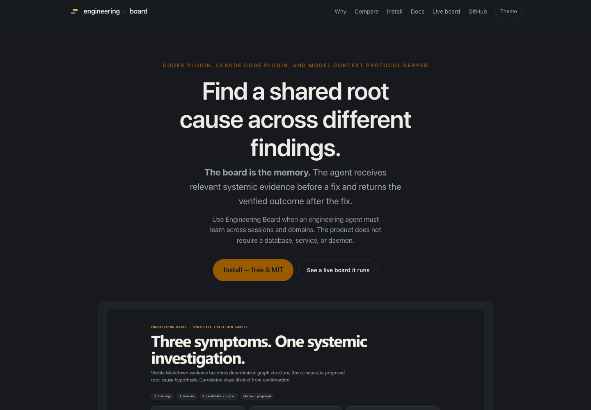
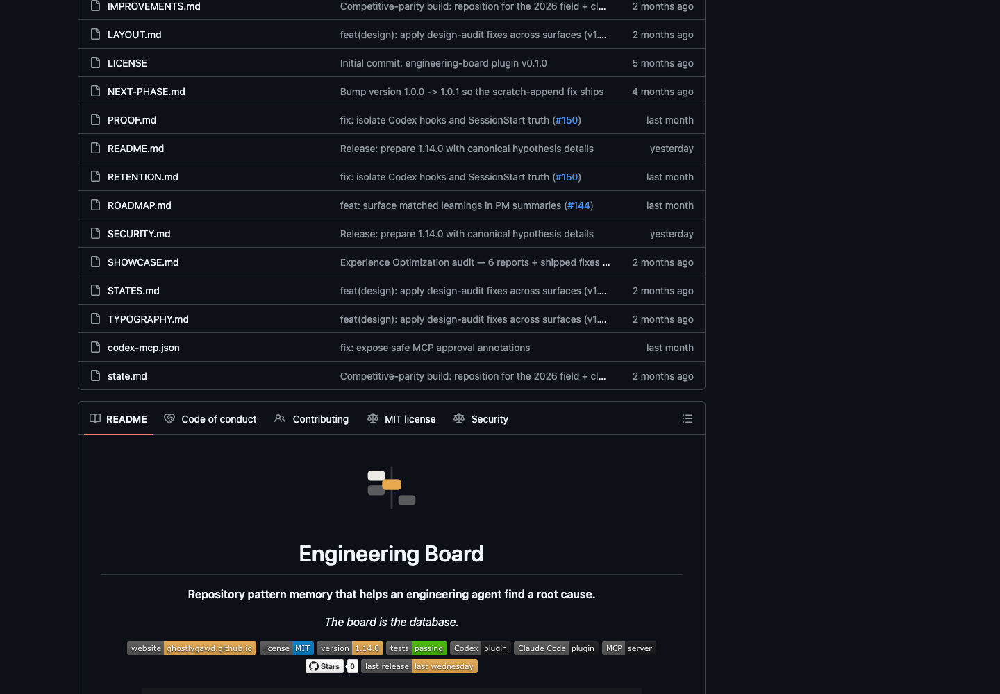
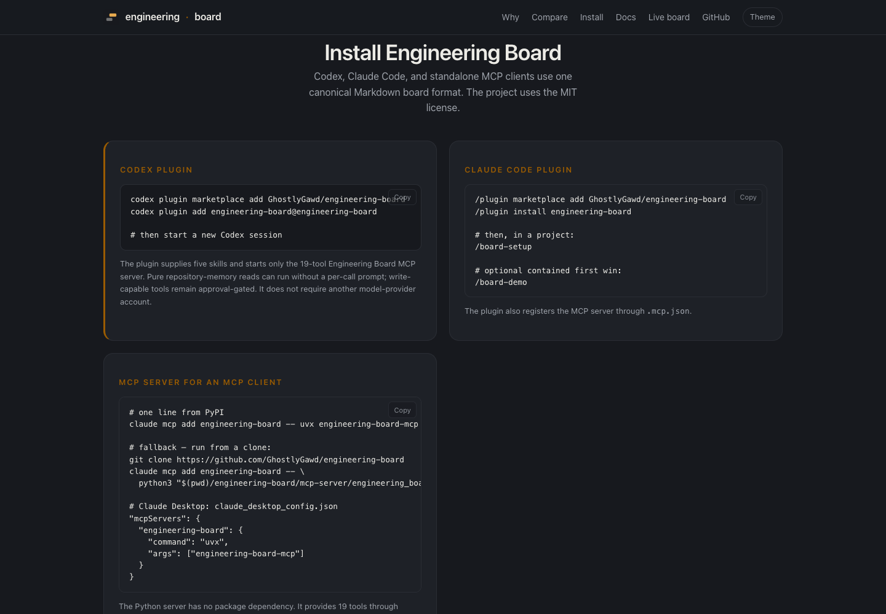
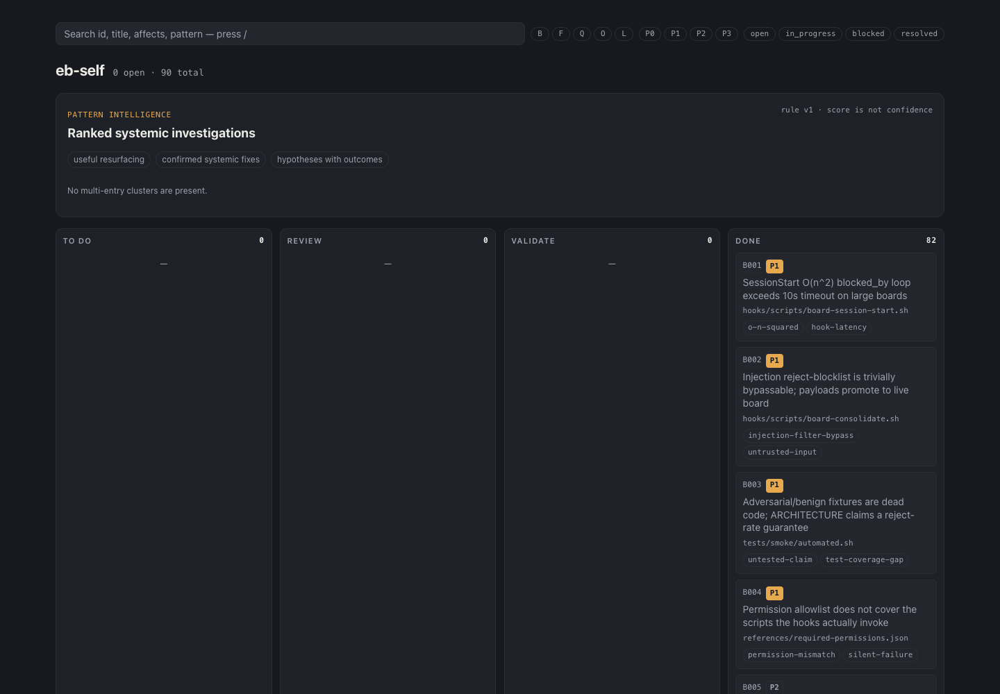
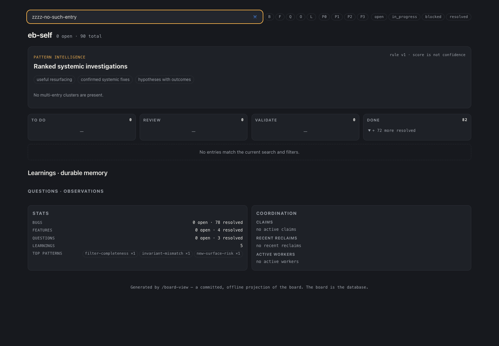
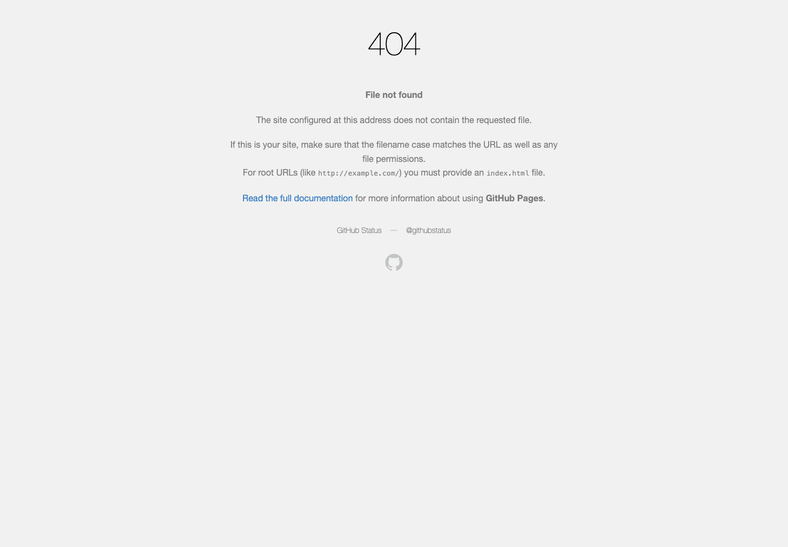
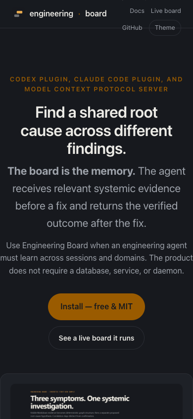
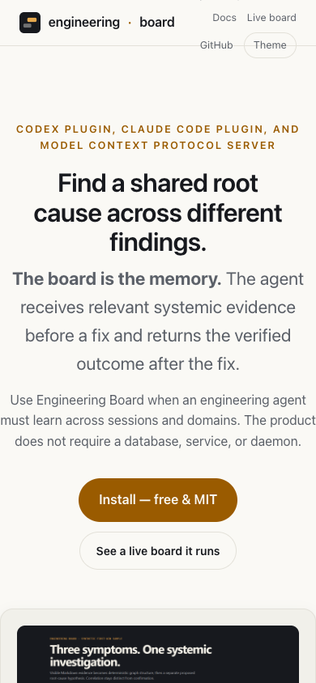

# Engineering Board: first experience audit

Captured September 10, 2026 local time (September 11 UTC). Owner: F007,
refero-audit-20260910-root. Independent review: [review.md](review.md).

## Outcome

The browser capability is working. The public experience has a consistent
ink/paper/amber foundation, explicit product positioning, visible installation
and board calls to action, and useful search feedback. The largest observed
failure is evidence navigation: the tested public board entry opens a 404.
The live board also lacks a populated investigation to demonstrate the product
promise, and the Codex installation card stops before a first useful task.

This is an expert audit of the public discovery and evidence-browsing journey,
with source review of command handoffs. It is not a new-user study, an installation
certification, or a full accessibility audit. No product or brand implementation
was changed. The public deployment's commit was not verified.

## Journey and evidence

1. **Discover — usable, with presentation concerns.** The desktop website
   states the root-cause investigation purpose and offers install/live-board
   actions. The rendered README repeats the purpose and shows synthetic evidence.
   The website says “The board is the memory”; the README says “The board is the
   database.” This is a messaging decision for the brief, not proven confusion.

   

   

2. **Start — incomplete local handoff.** Clicking Install reaches three client
   routes. The Codex card ends with starting a new session; the Claude Code card
   continues to setup and an optional demo. A concrete first task and expected
   result would make the Codex card more actionable. Installation was not rerun,
   and this finding does not assert that guidance is missing from all docs.

   

3. **Explore the board — controls work; demonstration is weak.** The live board
   opens with 0 open / 90 total, no multi-entry clusters, three empty workflow
   columns and a populated Done column. This state may be legitimate, but the
   destination does not show a populated investigation. Search for B001 isolates its card;
   a nonexistent query displays a no-results message and clear affordance.
   Global counts persist while filtered cards disappear; label their scope
   explicitly in the redesign rather than treating them as bad stored data.

   

   

4. **Inspect evidence — fails.** Clicking B001 navigates to
   `https://ghostlygawd.github.io/engineering-board/bugs/B001-sessionstart-on2-blockedby-loop-exceeds-10s-time.md`
   and shows GitHub Pages' 404. Independently reproduced in a second browser
   session. This blocks the tested journey before evidence and next-action
   comprehension can be assessed. Other entry destinations were not exhaustively
   tested. The underlying publication/generator cause remains unestablished.

   

5. **Mobile and theme checks — needs work.** At 390 × 844, navigation wraps
   across the header divider. The theme toggle changes the page from dark to
   light. In the captured view, the synthetic diagram's labels are very small.
   The document width measured 390px; do not infer global horizontal overflow
   from the screenshot. The comparison table exceeds the viewport inside its
   container. Touch-target and keyboard behavior require focused checks.

   

   

## Priorities for the design brief

| Priority | Observation | Implication |
| --- | --- | --- |
| First | Tested entry → 404 (B016) | Restore the route from a finding to its canonical evidence. |
| First | Empty live investigation demonstration | Provide a clearly labeled populated example, while keeping real project state truthful. |
| First | Codex install card ends at restart | Define one first task, expected result, and recovery route. |
| Next | Dark theme contrast and keyboard findings (B017) | Validate functional tokens and scrollable code blocks in rendered themes. |
| Next | Mobile header wrapping and small diagram text | Design mobile navigation and explanatory content intentionally. |
| Brief decision | Workflow-promotion mark versus investigation/memory positioning | Decide which product idea should lead the brand; preserve recognizability where useful. |

Brand strengths worth preserving for exploration: a recognizable compact mark,
restrained accent, explicit synthetic-example labeling, plain technical voice,
and a shared visual family between website and board. No palette, logo, or
layout direction is selected by this audit.

## Accessibility and verification

- Chrome for Testing 153.0.8010.36, agent-browser 0.37.1, axe-core 4.12.1.
- Desktop capture: 1440 × 1000; mobile capture: 390 × 844.
- Landing mobile dark scan: three violation categories. Eyebrow and primary CTA
  measured 3.24:1 where the checker requires 4.5:1. Inline trust links lacked
  sufficient distinction. Three scrollable installation code blocks lacked
  keyboard focusability. See [landing results](06-landing-a11y.json).
- Board scan: two best-practice violation categories concerning absent main
  landmark and content outside landmarks. Two contrast nodes were incomplete,
  not passes. See [board results](03-board-a11y.json).
- No page errors were reported when the board error log was checked.
- Search and no-results recovery affordance, Install navigation, live-board
  navigation, entry navigation, Docs navigation and theme toggle were observed.
- No installed agent conversation, fresh install, screen-reader test, full
  keyboard traversal, or hypothesis mutation was exercised. The tested public
  board contains no clusters, and the selected evidence route fails, so the
  populated investigation/detail experience remains untested.

## Refero research status

Live Refero access was verified with a developer-tool style search (10 previews)
and an issue-detail screen search (10 previews). These are research leads, not
a reference lock. No full styles or flows were adopted. Examples to investigate
in the later direction phase include Deno, SST, and Linear's issue-detail
patterns. Do not infer that their appearance is approved or that Engineering
Board needs a hosted task-management architecture.

## Reuse the browser capability

The browser binary is installed outside the repository at
`~/.agent-browser/browsers/chrome-153.0.8010.36`. The npm CLI is cached and can
be invoked with its pinned version. No repo package.json or dependency lockfile
was added.

```sh
npx --yes agent-browser@0.37.1 --session eb-audit open https://ghostlygawd.github.io/engineering-board/
npx --yes agent-browser@0.37.1 --session eb-audit snapshot -i
npx --yes agent-browser@0.37.1 --session eb-audit screenshot /tmp/engineering-board.png
npx --yes agent-browser@0.37.1 --session eb-audit close
```

For a fresh machine, run `npx --yes agent-browser@0.37.1 install` first.
Use fresh snapshot references before interactions. Reuse isolated sessions,
not personal browser profiles. Browser setup no longer blocks this project.

## Handoff

Independent review passes for these bounded findings; see [review.md](review.md).
B016 and B017 remain open implementation work. Audit completion does not close
those defects. Next step: agree the short design brief before visual directions.
The screenshot and report files remain in the working tree for review, not a
published release. Agent cost and user-outcome improvement are not measured.
